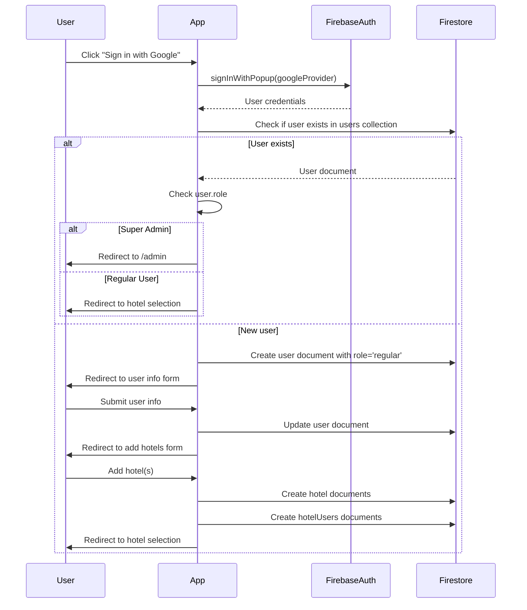
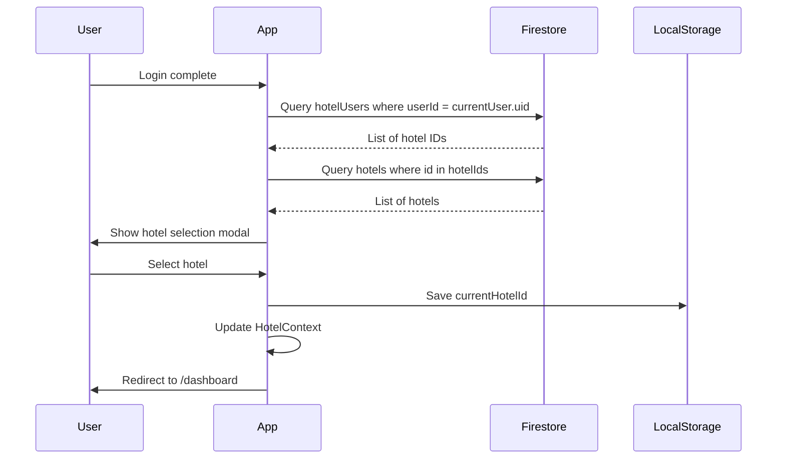
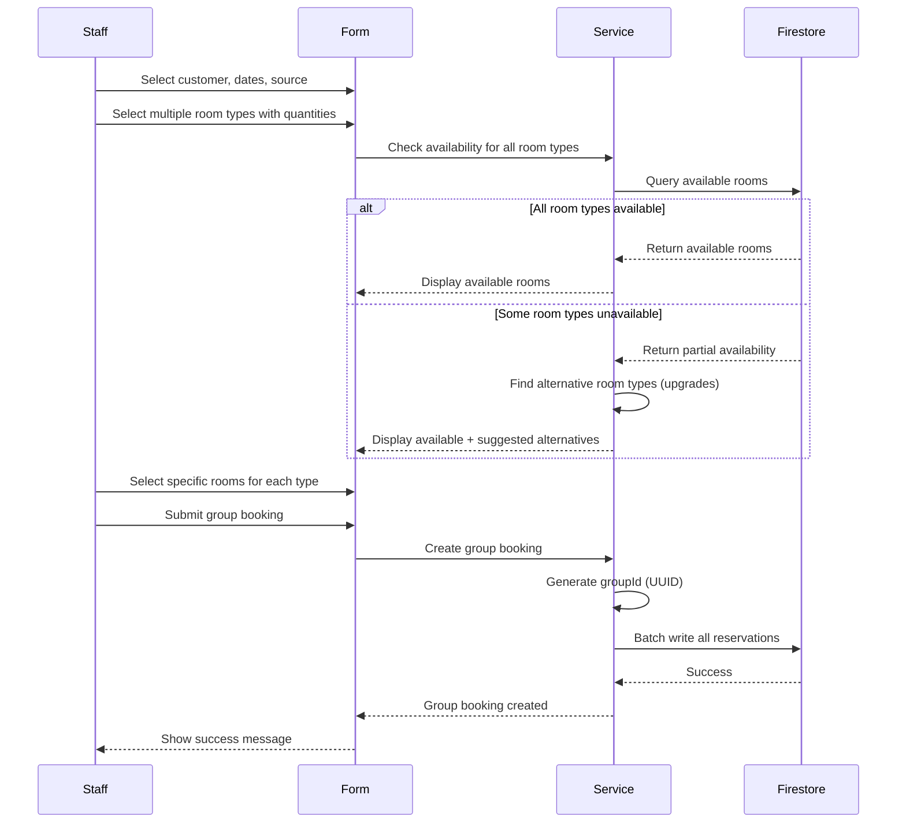

# Design Document: Hotel Management System

## Overview

The hotel management system is a multi-tenant web application built with React (JSX) + Vite, Ant Design, and Firebase. It enables hotel owners and staff to manage reservations, front desk operations, housekeeping, pricing, services, customers, and reporting. The system supports role-based access control (Super Admin and Regular Users with hotel-specific permissions), multi-language support via react-i18next, and a feature-based architecture for maintainability.

### Key Design Principles

1. **Multi-Tenancy**: All data is scoped by hotelId to ensure complete data isolation between hotels
2. **Feature-Based Architecture**: Code organized by business feature for scalability and maintainability
3. **Separation of Concerns**: UI components, business logic (hooks), and data access (services) are clearly separated
4. **Type Safety**: TypeScript interfaces for all data models and API contracts
5. **Internationalization**: All user-facing text supports multiple languages with lazy-loading
6. **Role-Based Access Control**: Permissions enforced at route, component, and data access levels

## Architecture

### High-Level Architecture

```
┌─────────────────────────────────────────────────────────────┐
│                         React App (Vite)                     │
│  ┌───────────────────────────────────────────────────────┐  │
│  │  Presentation Layer (Ant Design Components)           │  │
│  └───────────────────────────────────────────────────────┘  │
│  ┌───────────────────────────────────────────────────────┐  │
│  │  Business Logic Layer (Custom Hooks)                  │  │
│  └───────────────────────────────────────────────────────┘  │
│  ┌───────────────────────────────────────────────────────┐  │
│  │  Data Access Layer (Services)                         │  │
│  └───────────────────────────────────────────────────────┘  │
└─────────────────────────────────────────────────────────────┘
                            │
                            ▼
┌─────────────────────────────────────────────────────────────┐
│                      Firebase Backend                        │
│  ┌──────────────┐  ┌──────────────┐  ┌──────────────┐      │
│  │ Authentication│  │  Firestore   │  │   Storage    │      │
│  └──────────────┘  └──────────────┘  └──────────────┘      │
└─────────────────────────────────────────────────────────────┘
```

### Technology Stack

- **Frontend Framework**: React 18+ with JSX syntax
- **Build Tool**: Vite for fast development and optimized builds
- **UI Framework**: Ant Design 5.x for consistent, professional UI components
- **State Management**: React Context API for global state (auth, hotel selection, i18n)
- **Routing**: React Router v6 for client-side routing with protected routes
- **Internationalization**: react-i18next for multi-language support
- **Backend**: Firebase (Authentication, Firestore, Storage, Hosting)
- **Language**: TypeScript for type safety
- **Form Handling**: Ant Design Form with built-in validation


## Components and Interfaces

### Core Context Providers

#### AuthContext

Manages authentication state and user information.

```typescript
interface User {
  uid: string;
  email: string;
  displayName: string;
  photoURL: string;
  role: 'super_admin' | 'regular';
  language: string;
  phone?: string;
  address?: string;
  timezone?: string;
  status: 'active' | 'locked';
}

interface AuthContextValue {
  user: User | null;
  loading: boolean;
  signInWithGoogle: () => Promise<void>;
  signOut: () => Promise<void>;
  updateUserProfile: (data: Partial<User>) => Promise<void>;
}
```

#### HotelContext

Manages current hotel selection and hotel-specific data.

```typescript
interface Hotel {
  id: string;
  name: string;
  address: string;
  phone: string;
  email: string;
  checkInTime: string;
  checkOutTime: string;
  taxRate: number;
  currency: string;
  logoUrl?: string;
}

interface HotelContextValue {
  currentHotel: Hotel | null;
  hotels: Hotel[];
  loading: boolean;
  selectHotel: (hotelId: string) => void;
  addHotel: (hotel: Omit<Hotel, 'id'>) => Promise<string>;
  updateHotel: (hotelId: string, data: Partial<Hotel>) => Promise<void>;
}
```

#### I18nContext

Manages language selection and translation loading.

```typescript
interface I18nContextValue {
  language: string;
  changeLanguage: (lang: string) => Promise<void>;
  supportedLanguages: Array<{ code: string; name: string }>;
}
```

### Feature Modules

Each feature follows this structure:

```
src/features/{featureName}/
├── components/          # Feature-specific UI components
├── pages/              # Page components (route targets)
├── hooks/              # Custom hooks for business logic
├── services/           # Data access layer (Firestore operations)
├── models/             # TypeScript interfaces and types
├── constants/          # Feature-specific constants
├── utils/              # Helper functions
└── locales/            # Translation files
    ├── en.json
    ├── vi.json
    └── ...
```

### Routing Structure

```typescript
interface RouteConfig {
  path: string;
  element: React.ComponentType;
  protected: boolean;
  roles?: Array<'super_admin' | 'regular'>;
  permissions?: Array<'owner' | 'manager' | 'receptionist' | 'housekeeping'>;
}

const routes: RouteConfig[] = [
  { path: '/login', element: LoginPage, protected: false },
  { path: '/admin', element: AdminDashboard, protected: true, roles: ['super_admin'] },
  { path: '/dashboard', element: Dashboard, protected: true, roles: ['regular'] },
  { path: '/reservations', element: ReservationsPage, protected: true, roles: ['regular'], permissions: ['owner', 'manager', 'receptionist'] },
  // ... more routes
];
```


## Data Models

### Firestore Collections

#### users Collection

```typescript
interface UserDocument {
  uid: string;                    // Firebase Auth UID
  email: string;
  displayName: string;
  photoURL: string;
  role: 'super_admin' | 'regular';
  language: string;               // ISO 639-1 code (e.g., 'en', 'vi')
  phone?: string;
  address?: string;
  timezone?: string;              // IANA timezone (e.g., 'Asia/Ho_Chi_Minh')
  status: 'active' | 'locked';
  createdAt: Timestamp;
  updatedAt: Timestamp;
}
```

#### hotels Collection

```typescript
interface HotelDocument {
  id: string;
  name: string;
  address: string;
  phone: string;
  email: string;
  checkInTime: string;            // HH:mm format (e.g., '14:00')
  checkOutTime: string;           // HH:mm format (e.g., '12:00')
  taxRate: number;                // Percentage (e.g., 10 for 10%)
  currency: string;               // ISO 4217 code (e.g., 'USD', 'VND')
  cancellationPolicy: string;
  lateCheckoutFee: number;
  earlyCheckinFee: number;
  invoicePrefix: string;          // For invoice numbering
  invoiceCounter: number;
  logoUrl?: string;
  createdAt: Timestamp;
  updatedAt: Timestamp;
}
```

#### hotelUsers Collection

```typescript
interface HotelUserDocument {
  id: string;
  hotelId: string;
  userId: string;
  permission: 'owner' | 'manager' | 'receptionist' | 'housekeeping';
  createdAt: Timestamp;
  updatedAt: Timestamp;
}

// Composite index: (hotelId, userId)
```

#### roomTypes Collection

```typescript
interface RoomTypeDocument {
  id: string;
  hotelId: string;
  name: string;
  description: MultiLanguageText;
  basePrice: number;
  capacity: number;                // Max number of guests
  amenities: string[];
  weekdayPricing?: {
    monday?: number;
    tuesday?: number;
    wednesday?: number;
    thursday?: number;
    friday?: number;
    saturday?: number;
    sunday?: number;
  };
  seasonalPricing?: Array<{
    startDate: string;             // YYYY-MM-DD
    endDate: string;               // YYYY-MM-DD
    price: number;
  }>;
  createdAt: Timestamp;
  updatedAt: Timestamp;
}

interface MultiLanguageText {
  en?: string;
  vi?: string;
  // ... other language codes
}
```

#### rooms Collection

```typescript
interface RoomDocument {
  id: string;
  hotelId: string;
  roomNumber: string;
  roomTypeId: string;
  floor: number;
  status: 'vacant' | 'occupied' | 'dirty' | 'maintenance' | 'reserved';
  notes?: string;
  createdAt: Timestamp;
  updatedAt: Timestamp;
}

// Composite index: (hotelId, status)
```

#### reservations Collection

```typescript
interface ReservationDocument {
  id: string;
  hotelId: string;
  confirmationNumber: string;
  customerId: string;
  roomId: string;
  roomTypeId: string;
  checkInDate: string;            // YYYY-MM-DD
  checkOutDate: string;           // YYYY-MM-DD
  numberOfGuests: number;
  status: 'pending' | 'confirmed' | 'checked-in' | 'checked-out' | 'cancelled' | 'no-show';
  source: 'direct' | 'booking.com' | 'airbnb' | 'phone' | 'walk-in' | 'other';
  totalPrice: number;
  paidAmount: number;
  notes?: string;
  createdAt: Timestamp;
  updatedAt: Timestamp;
  checkedInAt?: Timestamp;
  checkedOutAt?: Timestamp;
}

// Composite indexes: (hotelId, checkInDate), (hotelId, status)
```

#### customers Collection

```typescript
interface CustomerDocument {
  id: string;
  hotelId: string;
  name: string;
  email: string;
  phone: string;
  address?: string;
  nationality?: string;
  idNumber?: string;              // Passport or ID card number
  companyId?: string;             // Reference to company if corporate guest
  preferences?: string;
  notes?: string;
  createdAt: Timestamp;
  updatedAt: Timestamp;
}

// Composite index: (hotelId, email)
```

#### companies Collection

```typescript
interface CompanyDocument {
  id: string;
  hotelId: string;
  name: string;
  taxId: string;
  address: string;
  phone: string;
  email: string;
  contactPerson?: string;
  discountRate?: number;          // Percentage discount for corporate rates
  createdAt: Timestamp;
  updatedAt: Timestamp;
}
```

#### services Collection

```typescript
interface ServiceDocument {
  id: string;
  hotelId: string;
  name: string;
  description: MultiLanguageText;
  price: number;
  category: 'laundry' | 'food' | 'transport' | 'spa' | 'other';
  taxable: boolean;
  active: boolean;
  createdAt: Timestamp;
  updatedAt: Timestamp;
}
```

#### serviceOrders Collection

```typescript
interface ServiceOrderDocument {
  id: string;
  hotelId: string;
  reservationId: string;
  serviceId: string;
  quantity: number;
  unitPrice: number;
  totalPrice: number;
  status: 'pending' | 'completed' | 'cancelled';
  orderedAt: Timestamp;
  completedAt?: Timestamp;
  notes?: string;
}

// Composite index: (hotelId, reservationId)
```

#### housekeepingTasks Collection

```typescript
interface HousekeepingTaskDocument {
  id: string;
  hotelId: string;
  roomId: string;
  assignedTo?: string;            // User ID of housekeeping staff
  taskType: 'clean' | 'deep-clean' | 'turndown' | 'inspection';
  priority: 'low' | 'normal' | 'high' | 'urgent';
  status: 'pending' | 'in-progress' | 'completed';
  notes?: string;
  createdAt: Timestamp;
  completedAt?: Timestamp;
}

// Composite index: (hotelId, status)
```

#### maintenanceTickets Collection

```typescript
interface MaintenanceTicketDocument {
  id: string;
  hotelId: string;
  roomId: string;
  reportedBy: string;             // User ID
  assignedTo?: string;            // User ID or external contractor
  issue: string;
  description: string;
  priority: 'low' | 'normal' | 'high' | 'urgent';
  status: 'open' | 'in-progress' | 'resolved' | 'closed';
  createdAt: Timestamp;
  resolvedAt?: Timestamp;
}

// Composite index: (hotelId, status)
```


### Service Layer Interfaces

Each feature has a service module that encapsulates Firestore operations:

```typescript
// Example: reservationService.ts
interface ReservationService {
  getReservations(hotelId: string, filters?: ReservationFilters): Promise<ReservationDocument[]>;
  getReservationById(id: string): Promise<ReservationDocument | null>;
  createReservation(data: Omit<ReservationDocument, 'id' | 'createdAt' | 'updatedAt'>): Promise<string>;
  updateReservation(id: string, data: Partial<ReservationDocument>): Promise<void>;
  cancelReservation(id: string): Promise<void>;
  checkIn(id: string): Promise<void>;
  checkOut(id: string): Promise<void>;
  getAvailableRooms(hotelId: string, checkIn: string, checkOut: string, roomTypeId?: string): Promise<RoomDocument[]>;
}

interface ReservationFilters {
  startDate?: string;
  endDate?: string;
  status?: ReservationDocument['status'];
  source?: ReservationDocument['source'];
  customerId?: string;
}
```

### Custom Hooks

Business logic is encapsulated in custom hooks:

```typescript
// Example: useReservations.ts
interface UseReservationsResult {
  reservations: ReservationDocument[];
  loading: boolean;
  error: Error | null;
  createReservation: (data: CreateReservationInput) => Promise<void>;
  updateReservation: (id: string, data: Partial<ReservationDocument>) => Promise<void>;
  cancelReservation: (id: string) => Promise<void>;
  checkIn: (id: string) => Promise<void>;
  checkOut: (id: string) => Promise<void>;
  refresh: () => Promise<void>;
}

function useReservations(filters?: ReservationFilters): UseReservationsResult;
```

### Authentication Flow



### Hotel Selection Flow



### Multi-Tenancy Data Access Pattern

All data queries must filter by hotelId:

```typescript
// CORRECT: Always filter by hotelId
const reservations = await getDocs(
  query(
    collection(db, 'reservations'),
    where('hotelId', '==', currentHotelId),
    where('checkInDate', '>=', startDate)
  )
);

// INCORRECT: Missing hotelId filter - would expose data from other hotels
const reservations = await getDocs(
  query(
    collection(db, 'reservations'),
    where('checkInDate', '>=', startDate)
  )
);
```

Firestore Security Rules enforce this at the database level:

```javascript
rules_version = '2';
service cloud.firestore {
  match /databases/{database}/documents {
    // Helper function to check if user has access to hotel
    function hasHotelAccess(hotelId) {
      return exists(/databases/$(database)/documents/hotelUsers/$(request.auth.uid + '_' + hotelId));
    }
    
    // Reservations must be scoped by hotelId
    match /reservations/{reservationId} {
      allow read: if request.auth != null && hasHotelAccess(resource.data.hotelId);
      allow create: if request.auth != null && hasHotelAccess(request.resource.data.hotelId);
      allow update, delete: if request.auth != null && hasHotelAccess(resource.data.hotelId);
    }
    
    // Similar rules for other collections...
  }
}
```


### Internationalization (i18n) Implementation

#### Translation File Organization

```
src/locales/
├── en/
│   ├── common.json          # Shared translations (buttons, labels, errors)
│   ├── sidebar.json         # Sidebar menu items
│   ├── dashboard.json       # Dashboard feature
│   ├── reservations.json    # Reservations feature
│   └── ...
├── vi/
│   ├── common.json
│   ├── sidebar.json
│   └── ...
└── index.ts                 # i18n configuration
```

#### i18n Configuration

```typescript
// src/locales/index.ts
import i18n from 'i18next';
import { initReactI18next } from 'react-i18next';
import LanguageDetector from 'i18next-browser-languagedetector';

// Import translations
import enCommon from './en/common.json';
import enSidebar from './en/sidebar.json';
import viCommon from './vi/common.json';
import viSidebar from './vi/sidebar.json';

const resources = {
  en: {
    common: enCommon,
    sidebar: enSidebar,
    // ... other namespaces
  },
  vi: {
    common: viCommon,
    sidebar: viSidebar,
    // ... other namespaces
  },
};

i18n
  .use(LanguageDetector)
  .use(initReactI18next)
  .init({
    resources,
    fallbackLng: 'en',
    defaultNS: 'common',
    interpolation: {
      escapeValue: false, // React already escapes
    },
  });

export default i18n;
```

#### Translation Usage Pattern

```typescript
// In components
import { useTranslation } from 'react-i18next';

function ReservationForm() {
  const { t } = useTranslation('reservations');
  
  return (
    <Form>
      <Form.Item label={t('form.checkInLabel')}>
        <DatePicker placeholder={t('form.checkInPlaceholder')} />
      </Form.Item>
      <Button type="primary">{t('form.submitButton')}</Button>
    </Form>
  );
}
```

#### Language Switcher Component

```typescript
import { useTranslation } from 'react-i18next';
import { Select } from 'antd';
import { useAuth } from '@/contexts/AuthContext';

const SUPPORTED_LANGUAGES = [
  { code: 'en', name: 'English' },
  { code: 'vi', name: 'Tiếng Việt' },
];

function LanguageSwitcher() {
  const { i18n } = useTranslation();
  const { user, updateUserProfile } = useAuth();
  
  const handleChange = async (languageCode: string) => {
    await i18n.changeLanguage(languageCode);
    if (user) {
      await updateUserProfile({ language: languageCode });
    }
  };
  
  return (
    <Select
      value={i18n.language}
      onChange={handleChange}
      options={SUPPORTED_LANGUAGES.map(lang => ({
        label: lang.name,
        value: lang.code,
      }))}
    />
  );
}
```

#### Multi-Language Content in Firestore

For content that needs to be stored in multiple languages (e.g., service descriptions):

```typescript
// Store as object with language codes as keys
const service: ServiceDocument = {
  id: 'service-1',
  hotelId: 'hotel-1',
  name: 'Laundry Service',
  description: {
    en: 'Professional laundry and dry cleaning service',
    vi: 'Dịch vụ giặt ủi và giặt khô chuyên nghiệp',
  },
  price: 50000,
  category: 'laundry',
  taxable: true,
  active: true,
  createdAt: Timestamp.now(),
  updatedAt: Timestamp.now(),
};

// Retrieve in current language
function useLocalizedService(service: ServiceDocument) {
  const { i18n } = useTranslation();
  const description = service.description[i18n.language] || service.description.en || '';
  return { ...service, description };
}
```

### Protected Routes Implementation

```typescript
// components/ProtectedRoute.tsx
import { Navigate, Outlet } from 'react-router-dom';
import { useAuth } from '@/contexts/AuthContext';
import { Spin } from 'antd';

interface ProtectedRouteProps {
  roles?: Array<'super_admin' | 'regular'>;
  redirectTo?: string;
}

function ProtectedRoute({ roles, redirectTo = '/login' }: ProtectedRouteProps) {
  const { user, loading } = useAuth();
  
  if (loading) {
    return <Spin size="large" />;
  }
  
  if (!user) {
    return <Navigate to={redirectTo} replace />;
  }
  
  if (roles && !roles.includes(user.role)) {
    return <Navigate to="/unauthorized" replace />;
  }
  
  return <Outlet />;
}

// components/HotelProtectedRoute.tsx
import { Navigate, Outlet } from 'react-router-dom';
import { useHotel } from '@/contexts/HotelContext';
import { Spin } from 'antd';

interface HotelProtectedRouteProps {
  permissions?: Array<'owner' | 'manager' | 'receptionist' | 'housekeeping'>;
}

function HotelProtectedRoute({ permissions }: HotelProtectedRouteProps) {
  const { currentHotel, loading, userPermission } = useHotel();
  
  if (loading) {
    return <Spin size="large" />;
  }
  
  if (!currentHotel) {
    return <Navigate to="/select-hotel" replace />;
  }
  
  if (permissions && !permissions.includes(userPermission)) {
    return <Navigate to="/unauthorized" replace />;
  }
  
  return <Outlet />;
}

// Usage in router
<Route element={<ProtectedRoute roles={['regular']} />}>
  <Route element={<HotelProtectedRoute />}>
    <Route path="/dashboard" element={<Dashboard />} />
    <Route path="/reservations" element={<ReservationsPage />} />
  </Route>
</Route>
```


### Layout and Navigation

```typescript
// components/MainLayout.tsx
import { Layout, Menu } from 'antd';
import { useTranslation } from 'react-i18next';
import { useNavigate, useLocation } from 'react-router-dom';
import {
  DashboardOutlined,
  CalendarOutlined,
  TeamOutlined,
  HomeOutlined,
  DollarOutlined,
  UserOutlined,
  BarChartOutlined,
  SettingOutlined,
} from '@ant-design/icons';

const { Header, Sider, Content } = Layout;

function MainLayout() {
  const { t } = useTranslation('sidebar');
  const navigate = useNavigate();
  const location = useLocation();
  const { currentHotel } = useHotel();
  const { user } = useAuth();
  
  const menuItems = [
    { key: '/dashboard', icon: <DashboardOutlined />, label: t('dashboard') },
    { key: '/reservations', icon: <CalendarOutlined />, label: t('reservations') },
    { key: '/front-desk', icon: <TeamOutlined />, label: t('frontDesk') },
    { key: '/rooms', icon: <HomeOutlined />, label: t('rooms') },
    { key: '/pricing', icon: <DollarOutlined />, label: t('pricing') },
    { key: '/customers', icon: <UserOutlined />, label: t('customers') },
    { key: '/reports', icon: <BarChartOutlined />, label: t('reports') },
    { key: '/settings', icon: <SettingOutlined />, label: t('settings') },
  ];
  
  return (
    <Layout style={{ minHeight: '100vh' }}>
      <Header>
        <div style={{ display: 'flex', justifyContent: 'space-between', alignItems: 'center' }}>
          <div>{currentHotel?.name}</div>
          <div>
            <LanguageSwitcher />
            <UserMenu />
          </div>
        </div>
      </Header>
      <Layout>
        <Sider collapsible>
          <Menu
            mode="inline"
            selectedKeys={[location.pathname]}
            items={menuItems}
            onClick={({ key }) => navigate(key)}
          />
        </Sider>
        <Content style={{ padding: '24px' }}>
          <Outlet />
        </Content>
      </Layout>
    </Layout>
  );
}
```

### Form Handling Pattern

Using Ant Design Form with validation:

```typescript
// Example: CreateReservationForm.tsx
import { Form, Input, DatePicker, Select, Button, message } from 'antd';
import { useReservations } from '@/features/reservations/hooks/useReservations';
import { useTranslation } from 'react-i18next';

interface ReservationFormValues {
  customerId: string;
  roomTypeId: string;
  checkInDate: Dayjs;
  checkOutDate: Dayjs;
  numberOfGuests: number;
  source: string;
}

function CreateReservationForm({ onSuccess }: { onSuccess: () => void }) {
  const [form] = Form.useForm<ReservationFormValues>();
  const { createReservation } = useReservations();
  const { t } = useTranslation('reservations');
  const [loading, setLoading] = useState(false);
  
  const handleSubmit = async (values: ReservationFormValues) => {
    setLoading(true);
    try {
      await createReservation({
        ...values,
        checkInDate: values.checkInDate.format('YYYY-MM-DD'),
        checkOutDate: values.checkOutDate.format('YYYY-MM-DD'),
      });
      message.success(t('form.createSuccess'));
      form.resetFields();
      onSuccess();
    } catch (error) {
      message.error(t('form.createError'));
    } finally {
      setLoading(false);
    }
  };
  
  return (
    <Form
      form={form}
      layout="vertical"
      onFinish={handleSubmit}
    >
      <Form.Item
        name="customerId"
        label={t('form.customerLabel')}
        rules={[{ required: true, message: t('form.customerRequired') }]}
      >
        <Select placeholder={t('form.customerPlaceholder')} />
      </Form.Item>
      
      <Form.Item
        name="roomTypeId"
        label={t('form.roomTypeLabel')}
        rules={[{ required: true, message: t('form.roomTypeRequired') }]}
      >
        <Select placeholder={t('form.roomTypePlaceholder')} />
      </Form.Item>
      
      <Form.Item
        name="checkInDate"
        label={t('form.checkInLabel')}
        rules={[{ required: true, message: t('form.checkInRequired') }]}
      >
        <DatePicker style={{ width: '100%' }} />
      </Form.Item>
      
      <Form.Item
        name="checkOutDate"
        label={t('form.checkOutLabel')}
        rules={[
          { required: true, message: t('form.checkOutRequired') },
          ({ getFieldValue }) => ({
            validator(_, value) {
              const checkIn = getFieldValue('checkInDate');
              if (!value || !checkIn || value.isAfter(checkIn)) {
                return Promise.resolve();
              }
              return Promise.reject(new Error(t('form.checkOutAfterCheckIn')));
            },
          }),
        ]}
      >
        <DatePicker style={{ width: '100%' }} />
      </Form.Item>
      
      <Form.Item>
        <Button type="primary" htmlType="submit" loading={loading}>
          {t('form.submitButton')}
        </Button>
      </Form.Item>
    </Form>
  );
}
```

### Pricing Calculation Logic

```typescript
// utils/pricingCalculator.ts
interface PricingInput {
  roomType: RoomTypeDocument;
  checkInDate: string;
  checkOutDate: string;
}

interface PricingResult {
  nights: number;
  breakdown: Array<{ date: string; price: number }>;
  subtotal: number;
  tax: number;
  total: number;
}

function calculateReservationPrice(
  input: PricingInput,
  taxRate: number
): PricingResult {
  const { roomType, checkInDate, checkOutDate } = input;
  const checkIn = dayjs(checkInDate);
  const checkOut = dayjs(checkOutDate);
  const nights = checkOut.diff(checkIn, 'day');
  
  const breakdown: Array<{ date: string; price: number }> = [];
  let subtotal = 0;
  
  for (let i = 0; i < nights; i++) {
    const currentDate = checkIn.add(i, 'day');
    const dateStr = currentDate.format('YYYY-MM-DD');
    const dayOfWeek = currentDate.format('dddd').toLowerCase();
    
    // Check seasonal pricing first
    let price = roomType.basePrice;
    if (roomType.seasonalPricing) {
      const seasonalRate = roomType.seasonalPricing.find(
        (season) => dateStr >= season.startDate && dateStr <= season.endDate
      );
      if (seasonalRate) {
        price = seasonalRate.price;
      }
    }
    
    // Apply weekday pricing if no seasonal pricing
    if (roomType.weekdayPricing && roomType.weekdayPricing[dayOfWeek]) {
      price = roomType.weekdayPricing[dayOfWeek];
    }
    
    breakdown.push({ date: dateStr, price });
    subtotal += price;
  }
  
  const tax = subtotal * (taxRate / 100);
  const total = subtotal + tax;
  
  return { nights, breakdown, subtotal, tax, total };
}
```


### Group Booking Implementation

#### Overview

Group bookings allow customers to reserve multiple rooms in a single transaction. The implementation uses a "linked reservations" approach where each room gets its own reservation document, but all reservations in the group are linked via a shared `groupId`.

#### Data Model Changes

Add the following fields to the `ReservationDocument` interface:

```typescript
interface ReservationDocument {
  // ... existing fields ...
  
  // Group booking fields
  groupId?: string;              // UUID linking reservations in the same group
  groupSize?: number;            // Total number of rooms in the group
  groupIndex?: number;           // Position in group (1, 2, 3, ...)
  isGroupBooking: boolean;       // Flag indicating if this is part of a group
}
```

#### Group Booking Flow



#### Service Layer Implementation

```typescript
// services/reservationService.ts

interface GroupBookingInput {
  hotelId: string;
  customerId: string;
  checkInDate: string;
  checkOutDate: string;
  source: Reservation['source'];
  notes?: string;
  rooms: Array<{
    roomId: string;
    roomTypeId: string;
    numberOfGuests: number;
    totalPrice: number;
  }>;
}

interface RoomAvailability {
  roomTypeId: string;
  roomTypeName: string;
  requestedQuantity: number;
  availableRooms: Room[];
  isFullyAvailable: boolean;
  alternatives?: Array<{
    roomTypeId: string;
    roomTypeName: string;
    availableRooms: Room[];
    priceComparison: number; // Percentage difference from requested type
  }>;
}

class ReservationService {
  /**
   * Check availability for multiple room types and suggest alternatives
   */
  async checkGroupAvailability(
    hotelId: string,
    checkInDate: string,
    checkOutDate: string,
    roomTypeRequests: Array<{ roomTypeId: string; quantity: number }>
  ): Promise<RoomAvailability[]> {
    const results: RoomAvailability[] = [];
    
    for (const request of roomTypeRequests) {
      const availableRooms = await this.getAvailableRooms(
        hotelId,
        checkInDate,
        checkOutDate,
        request.roomTypeId
      );
      
      const roomType = await roomTypeService.getRoomTypeById(request.roomTypeId);
      const isFullyAvailable = availableRooms.length >= request.quantity;
      
      let alternatives: RoomAvailability['alternatives'] = undefined;
      
      // If not fully available, find alternatives (upgrades)
      if (!isFullyAvailable) {
        alternatives = await this.findAlternativeRoomTypes(
          hotelId,
          checkInDate,
          checkOutDate,
          request.roomTypeId,
          request.quantity - availableRooms.length
        );
      }
      
      results.push({
        roomTypeId: request.roomTypeId,
        roomTypeName: roomType?.name || '',
        requestedQuantity: request.quantity,
        availableRooms,
        isFullyAvailable,
        alternatives,
      });
    }
    
    return results;
  }
  
  /**
   * Find alternative room types (typically upgrades) when requested type is unavailable
   */
  private async findAlternativeRoomTypes(
    hotelId: string,
    checkInDate: string,
    checkOutDate: string,
    requestedRoomTypeId: string,
    neededQuantity: number
  ): Promise<Array<{
    roomTypeId: string;
    roomTypeName: string;
    availableRooms: Room[];
    priceComparison: number;
  }>> {
    // Get requested room type for price comparison
    const requestedType = await roomTypeService.getRoomTypeById(requestedRoomTypeId);
    if (!requestedType) return [];
    
    // Get all room types for this hotel
    const allRoomTypes = await roomTypeService.getRoomTypes(hotelId);
    
    // Filter to room types with higher or equal capacity (upgrades)
    const upgrades = allRoomTypes.filter(
      rt => rt.id !== requestedRoomTypeId && rt.capacity >= requestedType.capacity
    );
    
    const alternatives = [];
    
    for (const upgrade of upgrades) {
      const availableRooms = await this.getAvailableRooms(
        hotelId,
        checkInDate,
        checkOutDate,
        upgrade.id
      );
      
      if (availableRooms.length >= neededQuantity) {
        const priceComparison = ((upgrade.basePrice - requestedType.basePrice) / requestedType.basePrice) * 100;
        
        alternatives.push({
          roomTypeId: upgrade.id,
          roomTypeName: upgrade.name,
          availableRooms: availableRooms.slice(0, neededQuantity),
          priceComparison: Math.round(priceComparison),
        });
      }
    }
    
    // Sort by price (cheapest alternatives first)
    alternatives.sort((a, b) => a.priceComparison - b.priceComparison);
    
    return alternatives;
  }
  
  /**
   * Create a group booking with multiple rooms
   */
  async createGroupBooking(input: GroupBookingInput): Promise<string[]> {
    const { hotelId, customerId, checkInDate, checkOutDate, source, notes, rooms } = input;
    
    // Validate all rooms are available
    for (const room of rooms) {
      const isAvailable = await this.checkRoomAvailability(
        hotelId,
        room.roomId,
        checkInDate,
        checkOutDate
      );
      
      if (!isAvailable) {
        throw new Error(`Room ${room.roomId} is not available for the selected dates`);
      }
    }
    
    // Generate group ID
    const groupId = crypto.randomUUID();
    const groupSize = rooms.length;
    const now = Timestamp.now();
    
    // Create batch write
    const batch = writeBatch(db);
    const reservationIds: string[] = [];
    
    // Create a reservation for each room
    rooms.forEach((room, index) => {
      const reservationRef = doc(collection(db, 'reservations'));
      const confirmationNumber = this.generateConfirmationNumber();
      
      const reservationData = deepRemoveUndefinedFields({
        hotelId,
        confirmationNumber,
        customerId,
        roomId: room.roomId,
        roomTypeId: room.roomTypeId,
        checkInDate,
        checkOutDate,
        numberOfGuests: room.numberOfGuests,
        status: 'pending' as const,
        source,
        totalPrice: room.totalPrice,
        paidAmount: 0,
        notes,
        groupId,
        groupSize,
        groupIndex: index + 1,
        isGroupBooking: true,
        createdAt: now,
        updatedAt: now,
      });
      
      batch.set(reservationRef, reservationData);
      reservationIds.push(reservationRef.id);
    });
    
    // Commit batch
    await batch.commit();
    
    return reservationIds;
  }
  
  /**
   * Get all reservations in a group
   */
  async getGroupReservations(groupId: string): Promise<Reservation[]> {
    const q = query(
      collection(db, 'reservations'),
      where('groupId', '==', groupId),
      orderBy('groupIndex', 'asc')
    );
    
    const snapshot = await getDocs(q);
    return snapshot.docs.map(doc => ({
      id: doc.id,
      ...doc.data(),
    })) as Reservation[];
  }
  
  /**
   * Cancel all reservations in a group
   */
  async cancelGroupBooking(groupId: string): Promise<void> {
    const reservations = await this.getGroupReservations(groupId);
    
    const batch = writeBatch(db);
    const now = Timestamp.now();
    
    reservations.forEach(reservation => {
      const docRef = doc(db, 'reservations', reservation.id);
      batch.update(docRef, {
        status: 'cancelled',
        updatedAt: now,
      });
    });
    
    await batch.commit();
  }
  
  /**
   * Check in all reservations in a group
   */
  async checkInGroup(groupId: string): Promise<void> {
    const reservations = await this.getGroupReservations(groupId);
    
    const batch = writeBatch(db);
    const now = Timestamp.now();
    
    reservations.forEach(reservation => {
      // Update reservation
      const reservationRef = doc(db, 'reservations', reservation.id);
      batch.update(reservationRef, {
        status: 'checked-in',
        checkedInAt: now,
        updatedAt: now,
      });
      
      // Update room status
      const roomRef = doc(db, 'rooms', reservation.roomId);
      batch.update(roomRef, {
        status: 'occupied',
        updatedAt: now,
      });
    });
    
    await batch.commit();
  }
  
  /**
   * Check out all reservations in a group
   */
  async checkOutGroup(groupId: string): Promise<void> {
    const reservations = await this.getGroupReservations(groupId);
    
    const batch = writeBatch(db);
    const now = Timestamp.now();
    
    reservations.forEach(reservation => {
      // Update reservation
      const reservationRef = doc(db, 'reservations', reservation.id);
      batch.update(reservationRef, {
        status: 'checked-out',
        checkedOutAt: now,
        updatedAt: now,
      });
      
      // Update room status
      const roomRef = doc(db, 'rooms', reservation.roomId);
      batch.update(roomRef, {
        status: 'dirty',
        updatedAt: now,
      });
      
      // Create housekeeping task
      const taskRef = doc(collection(db, 'housekeepingTasks'));
      batch.set(taskRef, {
        hotelId: reservation.hotelId,
        roomId: reservation.roomId,
        taskType: 'clean',
        priority: 'normal',
        status: 'pending',
        createdAt: now,
      });
    });
    
    await batch.commit();
  }
  
  /**
   * Calculate total price for group booking
   */
  calculateGroupTotal(reservations: Reservation[]): number {
    return reservations.reduce((sum, res) => sum + res.totalPrice, 0);
  }
}
```

#### UI Components

##### Group Booking Form

```typescript
// components/CreateGroupBookingForm.tsx

interface RoomTypeSelection {
  roomTypeId: string;
  quantity: number;
}

interface SelectedRoom {
  roomId: string;
  roomTypeId: string;
  numberOfGuests: number;
}

function CreateGroupBookingForm({ onSuccess, onCancel }: Props) {
  const [step, setStep] = useState<'select-types' | 'select-rooms' | 'confirm'>(1);
  const [roomTypeSelections, setRoomTypeSelections] = useState<RoomTypeSelection[]>([]);
  const [availability, setAvailability] = useState<RoomAvailability[]>([]);
  const [selectedRooms, setSelectedRooms] = useState<SelectedRoom[]>([]);
  
  const handleCheckAvailability = async () => {
    const results = await reservationService.checkGroupAvailability(
      currentHotel!.id,
      checkInDate,
      checkOutDate,
      roomTypeSelections
    );
    setAvailability(results);
    setStep('select-rooms');
  };
  
  const handleSubmit = async () => {
    // Calculate prices for each room
    const roomsWithPrices = selectedRooms.map(room => {
      const roomType = roomTypes.find(rt => rt.id === room.roomTypeId);
      const pricing = calculateReservationPrice(
        { roomType, checkInDate, checkOutDate },
        currentHotel!.taxRate
      );
      
      return {
        ...room,
        totalPrice: pricing.total,
      };
    });
    
    await reservationService.createGroupBooking({
      hotelId: currentHotel!.id,
      customerId,
      checkInDate,
      checkOutDate,
      source,
      notes,
      rooms: roomsWithPrices,
    });
    
    message.success(t('groupBooking.createSuccess'));
    onSuccess();
  };
  
  return (
    <Steps current={step}>
      <Step title={t('groupBooking.selectTypes')} />
      <Step title={t('groupBooking.selectRooms')} />
      <Step title={t('groupBooking.confirm')} />
    </Steps>
    
    {step === 'select-types' && (
      <RoomTypeSelectionStep
        roomTypes={roomTypes}
        selections={roomTypeSelections}
        onChange={setRoomTypeSelections}
        onNext={handleCheckAvailability}
      />
    )}
    
    {step === 'select-rooms' && (
      <RoomSelectionStep
        availability={availability}
        selectedRooms={selectedRooms}
        onChange={setSelectedRooms}
        onNext={() => setStep('confirm')}
        onBack={() => setStep('select-types')}
      />
    )}
    
    {step === 'confirm' && (
      <ConfirmationStep
        selectedRooms={selectedRooms}
        onSubmit={handleSubmit}
        onBack={() => setStep('select-rooms')}
      />
    )}
  );
}
```

##### Group Reservation Display

```typescript
// components/GroupReservationCard.tsx

function GroupReservationCard({ groupId, reservations }: Props) {
  const [expanded, setExpanded] = useState(false);
  const totalPrice = reservationService.calculateGroupTotal(reservations);
  
  return (
    <Card>
      <div onClick={() => setExpanded(!expanded)}>
        <Row>
          <Col span={12}>
            <Tag color="blue">GROUP</Tag>
            <strong>{reservations[0].confirmationNumber}</strong>
            <span> ({reservations.length} rooms)</span>
          </Col>
          <Col span={12} style={{ textAlign: 'right' }}>
            <strong>{totalPrice.toLocaleString()} VND</strong>
          </Col>
        </Row>
      </div>
      
      {expanded && (
        <div style={{ marginTop: 16 }}>
          {reservations.map((reservation, index) => (
            <Card key={reservation.id} size="small" style={{ marginBottom: 8 }}>
              <Row>
                <Col span={8}>Room {index + 1}: {reservation.roomNumber}</Col>
                <Col span={8}>{reservation.roomTypeName}</Col>
                <Col span={8} style={{ textAlign: 'right' }}>
                  {reservation.totalPrice.toLocaleString()} VND
                </Col>
              </Row>
            </Card>
          ))}
          
          <Space style={{ marginTop: 16 }}>
            <Button onClick={() => handleCheckInGroup(groupId)}>
              Check In All
            </Button>
            <Button onClick={() => handleCheckOutGroup(groupId)}>
              Check Out All
            </Button>
            <Button danger onClick={() => handleCancelGroup(groupId)}>
              Cancel All
            </Button>
          </Space>
        </div>
      )}
    </Card>
  );
}
```

#### Firestore Indexes

Add composite index for group queries:

```json
{
  "indexes": [
    {
      "collectionGroup": "reservations",
      "queryScope": "COLLECTION",
      "fields": [
        { "fieldPath": "hotelId", "order": "ASCENDING" },
        { "fieldPath": "groupId", "order": "ASCENDING" },
        { "fieldPath": "groupIndex", "order": "ASCENDING" }
      ]
    }
  ]
}
```

#### Alternative Suggestion Algorithm

The system suggests alternative room types when requested types are unavailable:

1. **Filter Criteria**: Only suggest room types with capacity >= requested type
2. **Availability Check**: Ensure sufficient quantity available
3. **Price Comparison**: Calculate percentage difference from requested type
4. **Sorting**: Present cheapest alternatives first
5. **User Choice**: Staff can accept alternatives or modify booking

This approach maximizes booking conversion by offering upgrades instead of rejecting the booking entirely.

## Correctness Properties

A property is a characteristic or behavior that should hold true across all valid executions of a system—essentially, a formal statement about what the system should do. Properties serve as the bridge between human-readable specifications and machine-verifiable correctness guarantees.

### Property Reflection

After analyzing all acceptance criteria, I identified the following key properties while eliminating redundancy:

- Authentication and user creation properties can be combined into user lifecycle properties
- Lock/unlock user operations are inverse operations (round-trip property)
- Hotel selection and data filtering are part of the same multi-tenancy property
- Dashboard metrics are all calculation properties that can be grouped
- Check-in and check-out are state transition properties
- Pricing calculations across different scenarios (weekday, seasonal) can be unified
- Form validation properties can be generalized across all forms

### Core Properties

#### Property 1: User Creation and Authentication Round-Trip

*For any* successful Google authentication, creating a user document in Firestore and then querying it should return a user with role='regular' and the authenticated user's email.

**Validates: Requirements 1.2**

#### Property 2: Role-Based Routing

*For any* authenticated user, the system should redirect to the admin dashboard if role='super_admin', or to hotel selection if role='regular'.

**Validates: Requirements 1.4**

#### Property 3: User Profile Update Round-Trip

*For any* valid user profile data (name, phone, address, language, timezone), submitting the data and then querying the user document should return the same data.

**Validates: Requirements 2.2**

#### Property 4: Hotel Creation with Permissions

*For any* hotel data submitted by a user, the system should create both a hotel document with a unique ID and a hotelUsers document linking the user to the hotel with 'owner' permission.

**Validates: Requirements 2.4, 2.5**

#### Property 5: Multiple Hotel Creation

*For any* list of N hotels added during registration, the system should create exactly N hotel documents and N hotelUsers documents.

**Validates: Requirements 2.6**

#### Property 6: Admin User List Completeness

*For any* set of users in the system, the admin dashboard should display all users with their name, email, role, and status fields present.

**Validates: Requirements 3.2**

#### Property 7: User Lock/Unlock Round-Trip

*For any* active user, locking then unlocking the user should restore the user to active status and allow login.

**Validates: Requirements 3.3, 3.4**

#### Property 8: User Hotel Association

*For any* user, viewing their details should display exactly the hotels they have hotelUsers documents for.

**Validates: Requirements 3.6**

#### Property 9: Hotel Access List Accuracy

*For any* regular user, the hotel selection modal should display exactly the hotels where a hotelUsers document exists for that user.

**Validates: Requirements 4.1**

#### Property 10: Hotel Selection Persistence Round-Trip

*For any* hotel selection, the currentHotelId should be persisted to localStorage and retrievable after page reload.

**Validates: Requirements 4.3**

#### Property 11: Multi-Tenancy Data Isolation

*For any* data query (reservations, rooms, customers, etc.), all returned results should have hotelId matching the currentHotelId, and no results from other hotels should be included.

**Validates: Requirements 4.4**

#### Property 12: Hotel Access Prevention

*For any* data access attempt when no hotel is selected (currentHotelId is null), the system should deny access and not return any hotel-specific data.

**Validates: Requirements 4.7**

#### Property 13: Dashboard Occupancy Calculation

*For any* set of rooms and reservations, the occupancy percentage should equal (number of occupied rooms / total rooms) * 100.

**Validates: Requirements 5.1, 5.2**

#### Property 14: Dashboard Revenue Calculation

*For any* set of reservations and service orders, the total revenue should equal the sum of all reservation totals plus all service order totals for the specified period.

**Validates: Requirements 5.3, 5.4**

#### Property 15: Reservation Filtering Accuracy

*For any* filter criteria (date range, status, source), all returned reservations should match all specified criteria, and no reservations matching the criteria should be excluded.

**Validates: Requirements 6.2**

#### Property 16: Reservation Creation with Correct Status

*For any* valid reservation data, creating a reservation should result in a document with status='pending' and all provided fields preserved.

**Validates: Requirements 6.4**

#### Property 17: Room Availability Validation

*For any* room and date range, if an active reservation exists for that room overlapping the date range, the room should be marked as unavailable for new reservations.

**Validates: Requirements 6.5**

#### Property 18: Reservation Edit Restriction

*For any* reservation, editing should be allowed if and only if the status is 'pending' or 'confirmed' (not 'checked-in', 'checked-out', or 'cancelled').

**Validates: Requirements 6.7**

#### Property 19: Reservation Cancellation Status Update

*For any* reservation, canceling it should update the status to 'cancelled' and preserve all other fields.

**Validates: Requirements 6.8**

#### Property 20: Check-In State Transition

*For any* reservation with status='confirmed', performing check-in should update status to 'checked-in', set checkedInAt timestamp, and mark the associated room as 'occupied'.

**Validates: Requirements 7.5**

#### Property 21: Check-Out State Transition

*For any* reservation with status='checked-in', performing check-out should update status to 'checked-out', set checkedOutAt timestamp, mark the room as 'dirty', and create a housekeeping task.

**Validates: Requirements 7.6, 7.7, 7.8**

#### Property 22: Housekeeping Task Completion

*For any* housekeeping task with status='pending' or 'in-progress', marking it as completed should update the associated room status to 'clean'.

**Validates: Requirements 8.5**

#### Property 23: Maintenance Ticket Room Status

*For any* room, creating a maintenance ticket should mark the room status as 'maintenance', and resolving the ticket should update the status to 'clean'.

**Validates: Requirements 8.6, 8.7, 8.8**

#### Property 24: Pricing Calculation Correctness

*For any* room type, check-in date, and check-out date, the calculated price should equal the sum of daily rates where each day uses seasonal pricing if available, otherwise weekday pricing if available, otherwise base price.

**Validates: Requirements 9.5**

#### Property 25: Seasonal Pricing Non-Overlap

*For any* room type, no two seasonal pricing periods should have overlapping date ranges.

**Validates: Requirements 9.6**

#### Property 26: Service Order Folio Posting

*For any* service order created for an in-house guest, the service charge should be added to the guest's folio with the correct amount (quantity * unit price).

**Validates: Requirements 10.4**

#### Property 27: Customer Search Accuracy

*For any* search query (name, email, or phone), all returned customers should contain the search term in at least one of those fields, and all customers matching the term should be included.

**Validates: Requirements 11.7**

#### Property 28: Occupancy Report Accuracy

*For any* date range, the occupancy report should calculate occupancy for each day as (reserved rooms / total rooms) * 100.

**Validates: Requirements 12.1**

#### Property 29: Revenue Report Completeness

*For any* date range, the revenue report should include all reservations and service orders with dates in that range, with correct totals by room type and service category.

**Validates: Requirements 12.2**

#### Property 30: Permission-Based Feature Access

*For any* user and hotel, if the user's permission level for that hotel is 'housekeeping', they should not be able to access pricing or reporting features.

**Validates: Requirements 13.3**

#### Property 31: Hotel Configuration Application

*For any* hotel configuration update (check-in time, tax rate, fees), all reservations created after the update should use the new configuration values.

**Validates: Requirements 14.8**

#### Property 32: Language Preference Persistence

*For any* language selection, the system should immediately update the UI to that language and persist the preference to the user's Firestore document, retrievable on next login.

**Validates: Requirements 15.3, 15.4**

#### Property 33: Unauthenticated Route Protection

*For any* protected route, attempting to access it without authentication should redirect to the login page.

**Validates: Requirements 16.1**

#### Property 34: Role-Based Route Protection

*For any* route requiring 'super_admin' role, attempting to access it with a 'regular' user should display an access denied message.

**Validates: Requirements 16.2**

#### Property 35: Hotel Selection Requirement

*For any* hotel-specific feature route, attempting to access it without a selected hotel should redirect to hotel selection.

**Validates: Requirements 16.3**

#### Property 36: Firestore Security Rules Enforcement

*For any* Firestore query, attempting to access documents with a hotelId that the user doesn't have permissions for should be denied by security rules.

**Validates: Requirements 18.5**

#### Property 37: Form Validation Rejection

*For any* form with validation rules, submitting invalid data (e.g., email without @ symbol, check-out date before check-in date) should prevent submission and display error messages.

**Validates: Requirements 19.1, 19.2, 19.3**

#### Property 38: Group Booking Atomicity

*For any* group booking with N rooms, the system should create exactly N reservation documents with the same groupId, or create none if any room is unavailable (all-or-nothing).

**Validates: Requirements 6.1.6**

#### Property 39: Group Booking Metadata Consistency

*For any* group booking, all reservations in the group should have the same groupId, the same groupSize value equal to the number of rooms, and unique groupIndex values from 1 to groupSize.

**Validates: Requirements 6.1.13**

#### Property 40: Group Availability Check Completeness

*For any* group booking request with multiple room types, the availability check should return results for all requested room types, indicating whether each is fully available.

**Validates: Requirements 6.1.2**

#### Property 41: Alternative Room Type Suggestions

*For any* unavailable room type in a group booking, if alternative room types exist with capacity >= requested capacity and sufficient availability, the system should suggest them sorted by price difference.

**Validates: Requirements 6.1.3**

#### Property 42: Group Check-In State Transition

*For any* group booking with groupId, performing group check-in should update all reservations in the group to status='checked-in', set checkedInAt timestamp for all, and mark all associated rooms as 'occupied'.

**Validates: Requirements 6.1.9**

#### Property 43: Group Check-Out State Transition

*For any* group booking with groupId and all reservations in status='checked-in', performing group check-out should update all reservations to status='checked-out', set checkedOutAt timestamp for all, mark all rooms as 'dirty', and create housekeeping tasks for all rooms.

**Validates: Requirements 6.1.10**

#### Property 44: Group Cancellation Consistency

*For any* group booking with groupId, canceling the group should update all reservations in the group to status='cancelled' and preserve all other fields.

**Validates: Requirements 6.1.11**

#### Property 45: Group Total Price Calculation

*For any* group booking, the total price should equal the sum of totalPrice fields from all reservations in the group.

**Validates: Requirements 6.1.12**


## Error Handling

### Error Categories

1. **Authentication Errors**: Firebase Auth failures, token expiration
2. **Authorization Errors**: Insufficient permissions, locked accounts
3. **Validation Errors**: Invalid form inputs, business rule violations
4. **Data Errors**: Firestore operation failures, network issues
5. **Not Found Errors**: Missing resources (hotel, reservation, customer)
6. **Conflict Errors**: Double booking, overlapping seasonal pricing

### Error Handling Strategy

#### Global Error Boundary

```typescript
// components/ErrorBoundary.tsx
import { Component, ReactNode } from 'react';
import { Result, Button } from 'antd';

interface Props {
  children: ReactNode;
}

interface State {
  hasError: boolean;
  error: Error | null;
}

class ErrorBoundary extends Component<Props, State> {
  constructor(props: Props) {
    super(props);
    this.state = { hasError: false, error: null };
  }
  
  static getDerivedStateFromError(error: Error): State {
    return { hasError: true, error };
  }
  
  componentDidCatch(error: Error, errorInfo: any) {
    console.error('Error caught by boundary:', error, errorInfo);
    // Log to error tracking service (e.g., Sentry)
  }
  
  render() {
    if (this.state.hasError) {
      return (
        <Result
          status="error"
          title="Something went wrong"
          subTitle="Please try refreshing the page"
          extra={
            <Button type="primary" onClick={() => window.location.reload()}>
              Refresh Page
            </Button>
          }
        />
      );
    }
    
    return this.props.children;
  }
}
```

#### Service Layer Error Handling

```typescript
// utils/errorHandler.ts
export class AppError extends Error {
  constructor(
    message: string,
    public code: string,
    public statusCode: number = 500
  ) {
    super(message);
    this.name = 'AppError';
  }
}

export function handleFirestoreError(error: any): AppError {
  if (error.code === 'permission-denied') {
    return new AppError(
      'You do not have permission to perform this action',
      'PERMISSION_DENIED',
      403
    );
  }
  
  if (error.code === 'not-found') {
    return new AppError(
      'The requested resource was not found',
      'NOT_FOUND',
      404
    );
  }
  
  if (error.code === 'unavailable') {
    return new AppError(
      'Service temporarily unavailable. Please try again.',
      'SERVICE_UNAVAILABLE',
      503
    );
  }
  
  return new AppError(
    'An unexpected error occurred',
    'INTERNAL_ERROR',
    500
  );
}

// In service methods
async function getReservation(id: string): Promise<ReservationDocument> {
  try {
    const doc = await getDoc(doc(db, 'reservations', id));
    if (!doc.exists()) {
      throw new AppError('Reservation not found', 'NOT_FOUND', 404);
    }
    return doc.data() as ReservationDocument;
  } catch (error) {
    throw handleFirestoreError(error);
  }
}
```

#### Form Validation Error Display

```typescript
// Ant Design Form automatically displays validation errors
// Custom validation for business rules:

const validateRoomAvailability = async (roomId: string, checkIn: string, checkOut: string) => {
  const conflicts = await reservationService.checkConflicts(roomId, checkIn, checkOut);
  if (conflicts.length > 0) {
    throw new Error('Room is not available for the selected dates');
  }
};

// In form
<Form.Item
  name="roomId"
  rules={[
    { required: true },
    {
      validator: async (_, value) => {
        const checkIn = form.getFieldValue('checkInDate');
        const checkOut = form.getFieldValue('checkOutDate');
        if (value && checkIn && checkOut) {
          await validateRoomAvailability(value, checkIn, checkOut);
        }
      },
    },
  ]}
>
  <Select />
</Form.Item>
```

#### User-Friendly Error Messages

```typescript
// locales/en/errors.json
{
  "PERMISSION_DENIED": "You don't have permission to perform this action",
  "NOT_FOUND": "The requested item was not found",
  "ROOM_UNAVAILABLE": "This room is not available for the selected dates",
  "INVALID_DATE_RANGE": "Check-out date must be after check-in date",
  "NETWORK_ERROR": "Network error. Please check your connection and try again",
  "AUTH_FAILED": "Authentication failed. Please try signing in again"
}

// Usage
import { useTranslation } from 'react-i18next';
import { message } from 'antd';

function handleError(error: AppError) {
  const { t } = useTranslation('errors');
  message.error(t(error.code) || error.message);
}
```

### Offline Handling

```typescript
// Enable Firestore offline persistence
import { enableIndexedDbPersistence } from 'firebase/firestore';

enableIndexedDbPersistence(db).catch((err) => {
  if (err.code === 'failed-precondition') {
    console.warn('Multiple tabs open, persistence enabled in first tab only');
  } else if (err.code === 'unimplemented') {
    console.warn('Browser does not support offline persistence');
  }
});

// Show offline indicator
import { useNetworkState } from 'react-use';

function OfflineIndicator() {
  const { online } = useNetworkState();
  
  if (online) return null;
  
  return (
    <Alert
      message="You are offline"
      description="Changes will be synced when connection is restored"
      type="warning"
      showIcon
      closable
    />
  );
}
```


## Testing Strategy

### Dual Testing Approach

The system requires both unit tests and property-based tests for comprehensive coverage:

- **Unit tests**: Verify specific examples, edge cases, and error conditions
- **Property tests**: Verify universal properties across all inputs
- Both approaches are complementary and necessary

### Property-Based Testing

#### Library Selection

For JavaScript/TypeScript, we will use **fast-check** as the property-based testing library.

```bash
npm install --save-dev fast-check @types/fast-check
```

#### Configuration

Each property test must:
- Run a minimum of 100 iterations
- Reference the design document property number
- Include a descriptive tag comment

```typescript
// Example property test structure
import fc from 'fast-check';
import { describe, it, expect } from 'vitest';

describe('Reservation Management', () => {
  /**
   * Feature: hotel-management-system, Property 16: Reservation Creation with Correct Status
   * For any valid reservation data, creating a reservation should result in a document
   * with status='pending' and all provided fields preserved.
   */
  it('should create reservations with pending status', async () => {
    await fc.assert(
      fc.asyncProperty(
        // Arbitraries (generators) for test data
        fc.record({
          hotelId: fc.uuid(),
          customerId: fc.uuid(),
          roomId: fc.uuid(),
          roomTypeId: fc.uuid(),
          checkInDate: fc.date().map(d => d.toISOString().split('T')[0]),
          checkOutDate: fc.date().map(d => d.toISOString().split('T')[0]),
          numberOfGuests: fc.integer({ min: 1, max: 10 }),
          source: fc.constantFrom('direct', 'booking.com', 'airbnb', 'phone', 'walk-in'),
        }),
        async (reservationData) => {
          // Arrange: Set up test environment
          const service = new ReservationService();
          
          // Act: Perform the operation
          const reservationId = await service.createReservation(reservationData);
          const created = await service.getReservationById(reservationId);
          
          // Assert: Verify the property holds
          expect(created).toBeDefined();
          expect(created!.status).toBe('pending');
          expect(created!.hotelId).toBe(reservationData.hotelId);
          expect(created!.customerId).toBe(reservationData.customerId);
          expect(created!.numberOfGuests).toBe(reservationData.numberOfGuests);
        }
      ),
      { numRuns: 100 } // Minimum 100 iterations
    );
  });
});
```

#### Custom Arbitraries

Define reusable generators for domain objects:

```typescript
// test/arbitraries/reservation.ts
import fc from 'fast-check';

export const reservationArbitrary = () =>
  fc.record({
    hotelId: fc.uuid(),
    confirmationNumber: fc.string({ minLength: 6, maxLength: 10 }).map(s => s.toUpperCase()),
    customerId: fc.uuid(),
    roomId: fc.uuid(),
    roomTypeId: fc.uuid(),
    checkInDate: fc.date({ min: new Date(), max: new Date(Date.now() + 365 * 24 * 60 * 60 * 1000) })
      .map(d => d.toISOString().split('T')[0]),
    checkOutDate: fc.date({ min: new Date(), max: new Date(Date.now() + 365 * 24 * 60 * 60 * 1000) })
      .map(d => d.toISOString().split('T')[0]),
    numberOfGuests: fc.integer({ min: 1, max: 10 }),
    status: fc.constantFrom('pending', 'confirmed', 'checked-in', 'checked-out', 'cancelled', 'no-show'),
    source: fc.constantFrom('direct', 'booking.com', 'airbnb', 'phone', 'walk-in', 'other'),
    totalPrice: fc.float({ min: 0, max: 100000, noNaN: true }),
    paidAmount: fc.float({ min: 0, max: 100000, noNaN: true }),
  });

export const validReservationArbitrary = () =>
  reservationArbitrary().filter(r => r.checkOutDate > r.checkInDate && r.paidAmount <= r.totalPrice);
```

### Unit Testing

#### Test Organization

```
src/features/{featureName}/
└── __tests__/
    ├── components/
    │   └── ReservationForm.test.tsx
    ├── hooks/
    │   └── useReservations.test.ts
    ├── services/
    │   └── reservationService.test.ts
    └── utils/
        └── pricingCalculator.test.ts
```

#### Example Unit Tests

```typescript
// services/__tests__/reservationService.test.ts
import { describe, it, expect, beforeEach, vi } from 'vitest';
import { ReservationService } from '../reservationService';

describe('ReservationService', () => {
  let service: ReservationService;
  
  beforeEach(() => {
    service = new ReservationService();
    // Mock Firestore
  });
  
  describe('createReservation', () => {
    it('should create a reservation with pending status', async () => {
      const data = {
        hotelId: 'hotel-1',
        customerId: 'customer-1',
        roomId: 'room-1',
        roomTypeId: 'type-1',
        checkInDate: '2024-01-15',
        checkOutDate: '2024-01-17',
        numberOfGuests: 2,
        source: 'direct' as const,
        totalPrice: 200,
        paidAmount: 0,
      };
      
      const id = await service.createReservation(data);
      const created = await service.getReservationById(id);
      
      expect(created?.status).toBe('pending');
    });
    
    it('should reject reservation if room is unavailable', async () => {
      // Test specific edge case
      const data = {
        hotelId: 'hotel-1',
        roomId: 'occupied-room',
        checkInDate: '2024-01-15',
        checkOutDate: '2024-01-17',
        // ... other fields
      };
      
      await expect(service.createReservation(data)).rejects.toThrow('Room is not available');
    });
  });
  
  describe('checkIn', () => {
    it('should update status to checked-in and set timestamp', async () => {
      const reservationId = 'reservation-1';
      await service.checkIn(reservationId);
      
      const updated = await service.getReservationById(reservationId);
      expect(updated?.status).toBe('checked-in');
      expect(updated?.checkedInAt).toBeDefined();
    });
  });
});
```

#### Component Testing

```typescript
// components/__tests__/ReservationForm.test.tsx
import { render, screen, fireEvent, waitFor } from '@testing-library/react';
import { describe, it, expect, vi } from 'vitest';
import ReservationForm from '../ReservationForm';

describe('ReservationForm', () => {
  it('should display validation error for invalid date range', async () => {
    render(<ReservationForm />);
    
    const checkInInput = screen.getByLabelText(/check-in/i);
    const checkOutInput = screen.getByLabelText(/check-out/i);
    
    fireEvent.change(checkInInput, { target: { value: '2024-01-17' } });
    fireEvent.change(checkOutInput, { target: { value: '2024-01-15' } });
    
    const submitButton = screen.getByRole('button', { name: /submit/i });
    fireEvent.click(submitButton);
    
    await waitFor(() => {
      expect(screen.getByText(/check-out date must be after check-in/i)).toBeInTheDocument();
    });
  });
  
  it('should submit form with valid data', async () => {
    const onSuccess = vi.fn();
    render(<ReservationForm onSuccess={onSuccess} />);
    
    // Fill form with valid data
    // ...
    
    const submitButton = screen.getByRole('button', { name: /submit/i });
    fireEvent.click(submitButton);
    
    await waitFor(() => {
      expect(onSuccess).toHaveBeenCalled();
    });
  });
});
```

### Integration Testing

Test complete user flows:

```typescript
// __tests__/integration/reservationFlow.test.ts
import { describe, it, expect } from 'vitest';

describe('Reservation Flow', () => {
  it('should complete full reservation lifecycle', async () => {
    // 1. Create reservation
    const reservationId = await reservationService.createReservation(testData);
    let reservation = await reservationService.getReservationById(reservationId);
    expect(reservation?.status).toBe('pending');
    
    // 2. Confirm reservation
    await reservationService.updateReservation(reservationId, { status: 'confirmed' });
    reservation = await reservationService.getReservationById(reservationId);
    expect(reservation?.status).toBe('confirmed');
    
    // 3. Check in
    await reservationService.checkIn(reservationId);
    reservation = await reservationService.getReservationById(reservationId);
    expect(reservation?.status).toBe('checked-in');
    
    // 4. Check out
    await reservationService.checkOut(reservationId);
    reservation = await reservationService.getReservationById(reservationId);
    expect(reservation?.status).toBe('checked-out');
    
    // 5. Verify room is marked dirty
    const room = await roomService.getRoomById(testData.roomId);
    expect(room?.status).toBe('dirty');
    
    // 6. Verify housekeeping task created
    const tasks = await housekeepingService.getTasksForRoom(testData.roomId);
    expect(tasks.length).toBeGreaterThan(0);
  });
});
```

### Test Coverage Goals

- **Unit Tests**: 80%+ code coverage
- **Property Tests**: All 37 correctness properties implemented
- **Integration Tests**: All major user flows covered
- **E2E Tests**: Critical paths (login, create reservation, check-in/out)

### Continuous Integration

```yaml
# .github/workflows/test.yml
name: Test Suite

on: [push, pull_request]

jobs:
  test:
    runs-on: ubuntu-latest
    steps:
      - uses: actions/checkout@v3
      - uses: actions/setup-node@v3
        with:
          node-version: '18'
      - run: npm ci
      - run: npm run test:unit
      - run: npm run test:property
      - run: npm run test:integration
      - name: Upload coverage
        uses: codecov/codecov-action@v3
```

